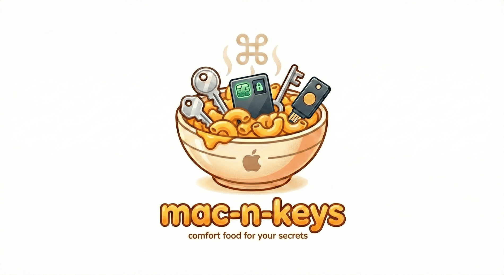
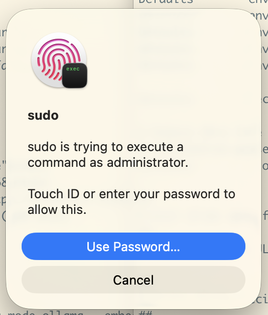

<p align="center">
  
</p>

> [!WARNING]
> This was vibe coded with Claude and reviewed with Gemini. Use with caution!

# mac-n-keys

Unified macOS secrets management with Secure Enclave and Touch ID.

Manages SSH keys, AGE encryption keys, and Apple Passwords from a single CLI. Every Touch ID prompt shows **which process** is requesting **which secret**, so you always know what you're approving.

## Why

macOS has great hardware security (Secure Enclave, Touch ID) but fragmented tooling:

- **secretive** — SSH keys only, no AGE support
- **age-plugin-se** — AGE keys only, poor observability in Touch ID prompts
- **apw** — Passwords.app access via TypeScript, no Touch ID gating
- **pam_tid.so** — sudo via Touch ID, but the prompt just says "sudo" with no context

<p align="center">
  
  <br>
  <em>Current state: Touch ID just says "sudo" — no idea what command is being run</em>
</p>

`mac-n-keys` fixes this by:
1. Showing the **calling process** (name + pid) in every Touch ID prompt
2. Supporting **SSH + AGE + Passwords** in one tool
3. Gating Passwords.app access behind Touch ID per request
4. Providing a PAM module for sudo that shows the **full command** being run

## Requirements

- macOS 26.2+ (Tahoe)
- Swift 6.2+
- Apple Silicon or T2 Mac (Secure Enclave required)

## Build

```sh
swift build
```

Produces two binaries in `.build/debug/`:
- `mac-n-keys` — main CLI
- `age-plugin-se` — standalone age plugin (discoverable by `age` CLI)

Run tests:

```sh
swift test
```

### PAM module (optional)

```sh
cd pam && make && sudo make install
```

Then add to `/etc/pam.d/sudo` (before other auth lines):

```
auth sufficient pam_mac_n_keys.so
```

## Commands

### `mac-n-keys ssh` — Secure Enclave SSH keys

Keys live in the Secure Enclave and cannot be exported. Signing requires Touch ID (or device passcode, depending on auth setting).

#### `ssh create <name>`

Create a new SSH key in the Secure Enclave.

```sh
mac-n-keys ssh create mykey
mac-n-keys ssh create work --algorithm ecdsa256 --auth biometry
mac-n-keys ssh create pq-key --algorithm mldsa65
```

| Option | Values | Default |
|--------|--------|---------|
| `--algorithm` | `ecdsa256`, `mldsa65`, `mldsa87` | `ecdsa256` |
| `--auth` | `none`, `presence`, `biometry` | `presence` |

- `none` — no authentication required to use the key
- `presence` — any unlock method (Touch ID, passcode, Apple Watch)
- `biometry` — fingerprint/face only

#### `ssh list`

```sh
mac-n-keys ssh list
mac-n-keys ssh list --verbose   # includes ID, algorithm, auth, fingerprint
```

#### `ssh public-key <name>`

Print the public key in OpenSSH format (pipe to `~/.ssh/authorized_keys`).

```sh
mac-n-keys ssh public-key mykey
mac-n-keys ssh public-key mykey --fingerprint   # SHA256 fingerprint
```

#### `ssh sign <name>`

Read data from stdin, sign it with Touch ID, output the signature.

```sh
echo "data" | mac-n-keys ssh sign mykey
echo "data" | mac-n-keys ssh sign mykey --hex
```

Touch ID prompt: *"Sign SSH request from **zsh (pid 1234)** using key **mykey**"*

#### `ssh delete <name>`

```sh
mac-n-keys ssh delete mykey
mac-n-keys ssh delete mykey --force   # skip confirmation
```

### `mac-n-keys age` — Secure Enclave AGE keys

Generate Secure Enclave-bound [AGE](https://age-encryption.org/) identities for use with `age` and [SOPS](https://github.com/getsops/sops).

#### `age keygen`

```sh
mac-n-keys age keygen -o key.txt
mac-n-keys age keygen --pq -o pq-key.txt                   # post-quantum hybrid
mac-n-keys age keygen --access-control any-biometry         # require fingerprint
mac-n-keys age keygen --recipient-type tag -o key.txt       # tag recipient format
```

| Option | Values | Default |
|--------|--------|---------|
| `-o, --output` | file path | stdout |
| `--access-control` | `none`, `passcode`, `any-biometry`, `any-biometry-or-passcode`, `any-biometry-and-passcode`, `current-biometry`, `current-biometry-and-passcode` | `any-biometry-or-passcode` |
| `--recipient-type` | `se`, `tag` | `se` |
| `--pq` | flag | off |

Output file is created with `0600` permissions. The public recipient key is printed to stderr.

#### `age recipients`

Extract public recipients from an identity file.

```sh
mac-n-keys age recipients -i key.txt
mac-n-keys age recipients -i key.txt --pq   # post-quantum recipient
```

| Option | Values | Default |
|--------|--------|---------|
| `-i, --input` | file path | stdin |
| `-o, --output` | file path | stdout |
| `--recipient-type` | `se`, `tag` | `se` |
| `--pq` | flag | off |

#### Using with `age` CLI

The `age` CLI discovers plugins by binary name. Copy `age-plugin-se` to your `$PATH`:

```sh
cp .build/debug/age-plugin-se /usr/local/bin/
```

Then encrypt/decrypt normally:

```sh
# Encrypt
echo "secret" | age -r age1se1qg8vw... > secret.age

# Decrypt — Touch ID prompt: "Decrypting for age (pid 1234)"
age -d -i key.txt secret.age
```

### `mac-n-keys passwords` — Apple Passwords.app

Access credentials stored in Apple's Passwords app from the terminal. Every credential access requires Touch ID, and the prompt shows the requesting process and target domain.

This works by communicating with `PasswordManagerBrowserExtensionHelper`, the same native helper that Safari and other browsers use to access Passwords.app. The helper ships with macOS and is discovered via Chrome/Firefox Native Messaging Host manifests at:

- `/Library/Google/Chrome/NativeMessagingHosts/com.apple.passwordmanager.json`
- `/Library/Application Support/Mozilla/NativeMessagingHosts/com.apple.passwordmanager.json`

#### How it works

```
┌──────────┐  Unix   ┌──────────┐  stdio (Native Messaging)  ┌──────────────────────────────────────┐
│ CLI      │◄─socket─►│ daemon   │◄──────────────────────────►│ PasswordManagerBrowserExtensionHelper │
│ commands │          │ (bridge) │  4-byte LE length + JSON    │ (ships with macOS)                   │
└──────────┘          └──────────┘                             └──────────────────────────────────────┘
```

1. **Daemon** (`mac-n-keys daemon`) launches the helper process and bridges between Unix socket (for CLI) and stdio Native Messaging (for the helper).
2. **Auth** (`mac-n-keys passwords auth`) performs an SRP handshake with the helper. Passwords.app displays a 6-digit verification code that you enter in the terminal. The resulting session key is stored in the macOS Keychain.
3. **Credential access** (`get`, `list`, `otp`) loads the session from Keychain (triggering Touch ID), encrypts the request with AES-GCM using the session key, sends it through the daemon, and decrypts the response.

#### Step-by-step setup

```sh
# 1. Start the daemon (bridges CLI ↔ PasswordManagerBrowserExtensionHelper)
mac-n-keys daemon &

# 2. Authenticate — Passwords.app will show a 6-digit code, enter it when prompted
mac-n-keys passwords auth

# 3. Access passwords (Touch ID required for each request)
mac-n-keys passwords get github.com
mac-n-keys passwords get github.com --username myuser
mac-n-keys passwords list github.com
mac-n-keys passwords otp github.com
```

#### `passwords auth`

Perform the SRP handshake with Passwords.app. This is a one-time setup step (until the session expires or you re-auth).

```sh
mac-n-keys passwords auth
```

What happens:
1. Generates random SRP credentials (username + private key)
2. Sends challenge to Passwords.app via the daemon
3. Passwords.app shows a **6-digit verification code** — type it in when prompted
4. Completes SRP key exchange (RFC 5054 with 3072-bit group)
5. Saves the session key to macOS Keychain (protected by `kSecAttrAccessibleWhenUnlockedThisDeviceOnly`)

| Option | Default |
|--------|---------|
| `--socket` | `~/.mac-n-keys/daemon.sock` |

#### `passwords get <url>`

Retrieve the password for a URL. Triggers Touch ID.

```sh
mac-n-keys passwords get github.com
mac-n-keys passwords get github.com --username myuser
```

Touch ID prompt: *"Accessing password for **github.com** requested by **zsh (pid 1234)**"*

Output:
```
Username: myuser
Password: hunter2
```

#### `passwords list <url>`

List all stored usernames for a URL. Triggers Touch ID.

```sh
mac-n-keys passwords list github.com
```

#### `passwords otp <url>`

Get the current TOTP code for a URL. Triggers Touch ID.

```sh
mac-n-keys passwords otp github.com
```

If the URL has no scheme, `https://` is prepended automatically.

### `mac-n-keys daemon`

Run the Unix socket bridge daemon. Required for all `passwords` commands.

```sh
mac-n-keys daemon                              # default socket (~/.mac-n-keys/daemon.sock)
mac-n-keys daemon --socket /path/to/custom.sock # custom socket path
```

The daemon launches `PasswordManagerBrowserExtensionHelper` as a subprocess and relays JSON messages between Unix socket clients and the helper's stdio pipe using the [Chrome Native Messaging protocol](https://developer.chrome.com/docs/extensions/develop/concepts/native-messaging) (4-byte little-endian length prefix + JSON).

### PAM module for sudo

After installing, `sudo` shows a Touch ID prompt with the full command and calling process:

```
sudo rm -rf /tmp
# Touch ID prompt: "sudo rm -rf /tmp requested by Terminal.app (pid 1234)"
```

## Architecture

```
Sources/
  MacNKeys/          CLI (swift-argument-parser)
    Commands/
      SSH/               create, list, public-key, sign, delete
      AGE/               keygen, recipients
      Passwords/         auth, get, list, otp
    CLI.swift            Entry point
  AgePluginSE/           Standalone age-plugin-se binary
    main.swift           Delegates to shared Lib code
  Lib/                   Shared library
    ProcessTracer        Parent process detection (proc_pidpath, sysctl)
    SessionKeychain      Keychain storage with Touch ID (.userPresence)
    SSH/
      SecureEnclaveKeys  SE key CRUD (P256.Signing, MLDSA65, MLDSA87)
    AGE/
      Plugin             age-plugin protocol (recipient-v1, identity-v1)
      Crypto             SE crypto with fresh LAContext per operation
      HPKE               DHKEM(P-256) + MLKEM768-P256 hybrid
      Bech32             Bech32 encoding for age recipients/identities
      Stream             Line-based I/O abstraction
    SRP/
      SRPSession         RFC 5054 SRP with AES-GCM encrypt/decrypt
      SRPConstants       3072-bit group prime (generator = 5)
    Transport/
      NativeMessaging    Launch + talk to PasswordManagerBrowserExtensionHelper
      DaemonConnection   Unix socket listener + client
      PasswordsProtocol  Message constructors for Passwords.app protocol
pam/
  pam_mac_n_keys.c    C PAM module (LocalAuthentication via ObjC)
  Makefile
Tests/
  SRPTests               SRP handshake, encrypt/decrypt, serialization
  AGETests               Stanza round-trip, identity/recipient parsing, HPKE
  Bech32Tests            Encode/decode
  Base64Tests            Raw base64 (no padding)
  ProcessTracerTests     Parent process detection
```

## Credits

Built on ideas and code from:
- [secretive](https://github.com/maxgoedjen/secretive) — Secure Enclave SSH key management
- [age-plugin-se](https://github.com/remko/age-plugin-se) — AGE plugin for Secure Enclave
- [apw](https://github.com/nichochar/apw) — Apple Passwords CLI (TypeScript)
